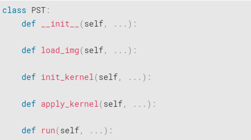
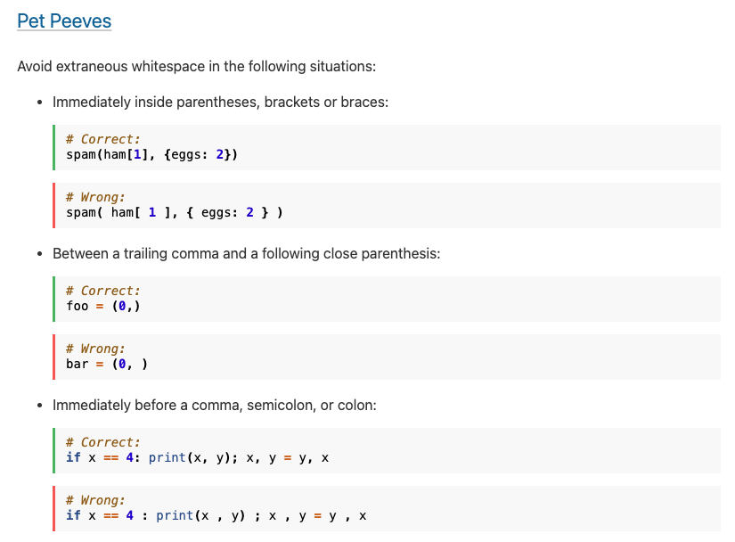
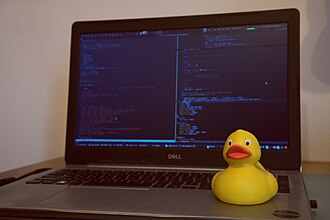

---
exports:
  - format: pdf
    template: lapreprint-typst
    id: notes-1a
downloads:
  - id: notes-1a
    title: PDF notes
---

# Course Intro
This is a computational physics course, focusing on learning and applying the numerical methods common in solving physics problems. As with many advanced and applied topics, this course ends up being a mix of interdisciplinary studies: the mathematics underpinning the development of these methods, their implementation with computer programming, and the physics of the problems themselves.


## What is programming?
As such, computer programming is a broad umbrella term for multiple areas of knowledge and types of technical skills. Together, these can be thought of as making up the *craft* of programming. When people talk about coding they might be referring to specific elements of this craft:

### Syntax
Refers to the specific vocabulary of a programming language; knowing syntax means knowing the specific commands and how to use them to write programs (the grammar of putting words into sentences). 


Most introductory coding courses focus on teaching the specific syntax of a language. In this course, we will primarily use Python syntax, but this is not a dedicated Python course. We will discuss and review some of the basics in the first two weeks of the course. 

### Algorithm
Algorithms are largely language-independent. They describe how we compute or execute specific tasks in code in a series of steps. The code written in a specific language is the implementation of the algorithm.


Implementations of algorithms use syntax rules, like how you would write complete sentences using grammar rules.

In this course, from week three onward, our content focus each week is on the implementation of various numerical algorithms for solving physics problems. 

### Architecture
An algorithm is used for a specific task that is performed. Often times, when we are writing code we need to perform several tasks that depend on each other. 
For example, a data analysis pipeline will need to read in and format data, perform an analysis on the data using some dedicated algorithm, and then return a file with the result. How these different tasks relay information to and depend on each other, what inputs change how the tasks are performed, and the overall structure of the code is it's architecture. 




If algorithms are like our individual sentences, then architecture refers to the overall plot of a short story (or novel, depending on how large your code is!) 

## Style
While a language's syntax tells us the basic rules we need to follow in order to be understood, we can usually put together syntax in many different ways to get to the same result. 
Style refers to the individual choices we make throughout in how we write code: which method we iterate with in what situation, how we name variables and functions, which types of optional features of a language we might use, or even what kind of objects or data structures we use for different types of tasks or problems. 
You might see people refer to some ways of doing things as more or less "Pythonic" which is typically an element of style. This generally means there are other allowable ways of doing the same thing, but some are more in line with the intention and design of the language itself (which can also be a matter of opinion!)

Some codebase, software, and languages will even have a [Style Guide](https://peps.python.org/pep-0008/) which detail the expectations for formatting code when contributing or writing new software.

From the python style guide:  



Like there is for style in writing or clothes, what is considered "good" style is subjective and many people have their own opinions. (For a start, many software developers recommend the principles in [Clean Code](https://dl.acm.org/doi/abs/10.5555/1388398) by Robert C. Martin.)

Often adhering to a specific style, regardless of which one (make your own!), makes your code more legible to others (including yourself in the future). I encourage you to play around with style and find what makes sense. Code you like reading is also code you'll like editing and writing!

### Testing and Validation
While we often talk about *writing* code, in practice, we spend most of our time and effort not on physically writing code, but on debugging and making sure it works.

Just as books have to be edited by a publisher before they are printed, we have to test code to make sure it can:
1. Run without error 
2. Does what we intend it to do (validate)

Often times, debugging focuses on the first point, but the scariest code is one that runs but does something different than that we wanted along the way!

There are a variety of tools that can help you catch bugs (that you can use in your workflow as part of your computing environment), but also standard [debugging practice](https://docs.python.org/3/faq/programming.html#general-questions) like introducing break points and writing unit tests that are part of the craftsmanship of coding just as much as actually writing the code. 

The most recommended [debugging tool](https://en.wikipedia.org/wiki/Rubber_duck_debugging):



Zero-order, you should at least be using diagnostic `print` statements to check your work (this is typically sufficient for relatively contained programs and scripts that you'll be writing for homework and in-class.)

### Computing Environment
While programming, your computer, it's operating system, your development environment (IDE, etc.), your package manager, your shell environment are all tools of the trade. Your knowledge of these tools will help you develop your programming practice and choosing some that work well for your purposes and setup can make improvements in your general quality of life.

Most high performance computing (HPC) assumes a general familiarity with the basic tools and setup of [Unix-based](https://en.wikipedia.org/wiki/Unix) environments. Basically, it really helps if you know how a computer works -- at least enough to be able to get answers about what's going on when there's a problem. 

## Programming in Computational Physics 
In practice, in this course we will focus on algorithm development and coding from scratch with limited use of high-level libraries. This has the benefit of being quite similar across most programming languages so it is very transferable to Julia, C, Fortran, etc. 

While assignments will typically focus on implementing algorithms, I encourage you to use this course as an opportunity to practice and develop your skills with the other parts of the craft, as well. 

```{note}
Some collected resources focusing on different aspects of programming that might be useful or of interest can be found on the [Course Resources](../2_cheat_sheet.md) page. 
```

